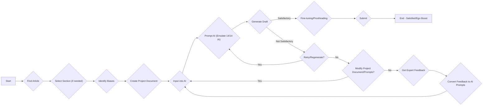

```mermaid
graph LR
    A[Start] --> B{Find Article};
    B --> C{"Select Section (if needed)"};
    C --> D{Identify Biases};
    D --> E{Create Project Document};
    E --> F{Input into AI};
    F --> G{"Prompt AI (Emulate 14/14 IA)"};
    G --> H{Generate Draft};
    H -- Satisfactory --> I{Fine-tuning/Proofreading};
    I --> J{Submit};
    H -- Not Satisfactory --> K{Retry/Regenerate?};
    K -- Yes --> G;
    K -- No --> L{Modify Project Document/Prompts?};
    L -- Yes --> F;
    L -- No --> M{Get Expert Feedback};
    M --> N{Convert Feedback to AI Prompts};
    N --> F;
    J --> O[End - Satisfied/Ego Boost]
```